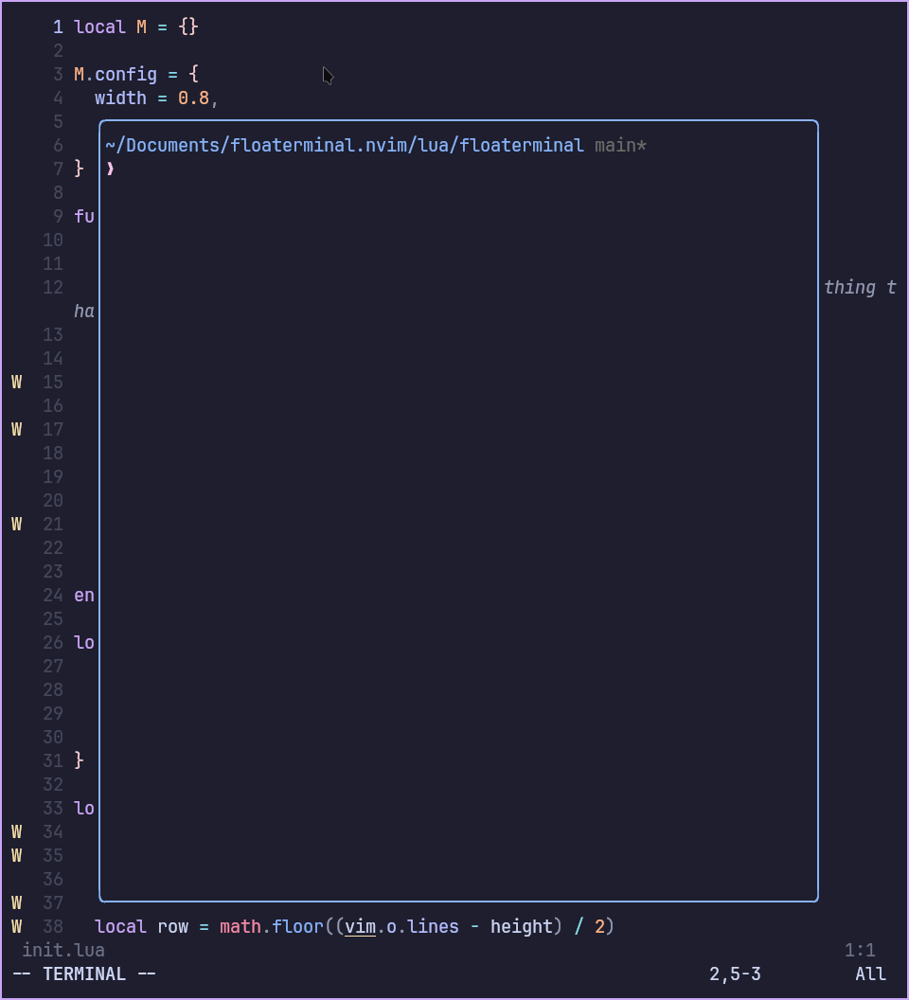

# floaterminal.nvim

A simple floating terminal plugin for Neovim based on this [video](https://youtu.be/5PIiKDES_wc?si=NAfHfKuKz-IjBLEb).



## Installation

Using [lazy.nvim](https://github.com/folke/lazy.nvim), you can add this to your `/plugins/floaterminal.nvim` in your `nvim` config:
```lua
return {
    "rkb121541/floaterminal.nvim",
    config = function()
        require("floaterminal").setup({
            width = 0.8,
            height = 0.8,
            keymap = "<leader>tt",
        })
    end,
}
```

You can change the above defaults as you like, or if you want to keep them you can just use the snippet below:
```lua
return {
    "rkb121541/floaterminal.nvim",
    config = function()
        require("floaterminal").setup()
    end,
}
```